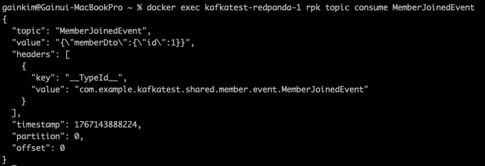
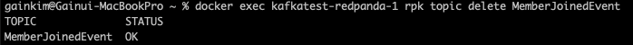
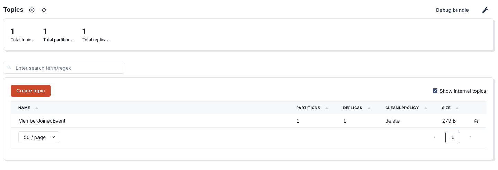
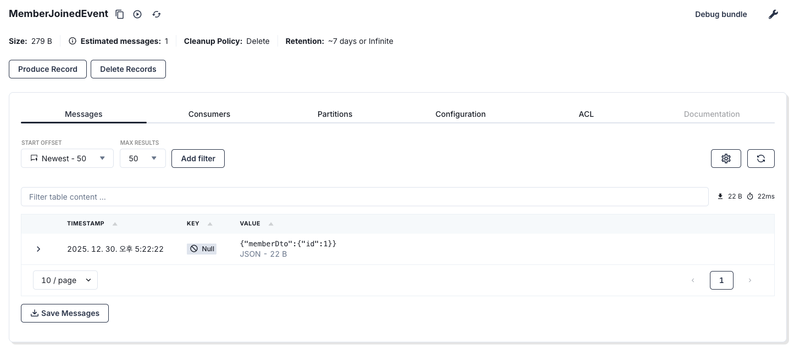

## Kafka

### 용어 정리
* 토픽: 레코드(이벤트)들이 저장되는 별도의 저장소 (mysql 저장소 같은 개념)
* 레코드: 카프카에서는 이벤트를 레코드라고 부른다.
* 프로듀서: 이벤트를 생성하는 주체 `eventPublisher.publishEvent(...)`
* 컨슈머: 이벤트를 수신하는 주체 `@KafkaListener(topics = "MemberJoinedEvent")`

### 실행 흐름 요약
1. kafkaProducer를 감싸고 있는 인스턴스인 KafkaTemplate 을 사용하여 Kafka cluster에 message send
```java
// EventPublisher.java
@Service
@RequiredArgsConstructor
public class EventPublisher {
  private final KafkaTemplate<String, HaveEventName> kafkaTemplate;

  public void publish(HaveEventName event) {
    kafkaTemplate.send(event.getEventName(), event);
  }
}
```

2. 이벤트 퍼블리셔에서 이벤트 생성
```java
// MemberDataInit.java
eventPublisher.publish(new MemberJoinedEvent(new MemberDto(1)));
```
3. 이벤트 리스너에서 수신 (@KafkaListener 사용)
```java
// PostEventListener.java
  @KafkaListener(topics = "MemberJoinedEvent", groupId = "PostEventListener__handle__1")
  public void handle(MemberJoinedEvent event) {
    System.out.println("handle, MemberJoinedEvent, member: " + event.memberDto().id());
  }

  // handle2, handle2Again 는 같은 groupId 를 사용하므로 같은 consumer group 에 속하게 된다.
  // 즉, 둘 중 하나의 메서드에서만 이벤트가 처리된다.
  @KafkaListener(topics = "MemberJoinedEvent", groupId = "PostEventListener__handle__2")
  public void handle2(MemberJoinedEvent event) {
    System.out.println("handle2, MemberJoinedEvent, member: " + event.memberDto().id());
  }

  // handle2, handle2Again 는 같은 groupId 를 사용하므로 같은 consumer group 에 속하게 된다.
  // 즉, 둘 중 하나의 메서드에서만 이벤트가 처리된다.
  @KafkaListener(topics = "MemberJoinedEvent", groupId = "PostEventListener__handle__2")
  public void handle2Again(MemberJoinedEvent event) {
    System.out.println("handle2-again, MemberJoinedEvent, member: " + event.memberDto().id());
  }
```

### 토픽 레코드 확인
```
docker exec kafkatest-redpanda-1 rpk topic consume MemberJoinedEvent
```


### 토픽 레코드 삭제
```
docker exec kafkatest-redpanda-1 rpk topic delete MemberJoinedEvent
```


### 레드판다 콘솔 접속
[레드판다 콘솔](http://localhost:8090/overview)

### 콘솔에서 토픽 확인

